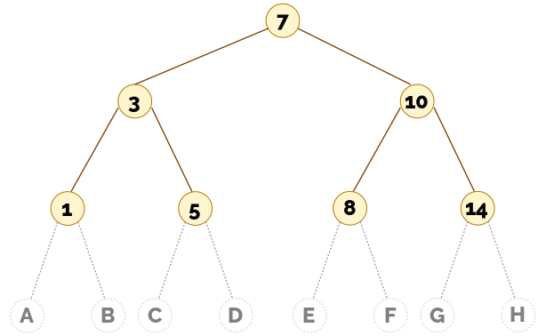

# Ejercicio - Inserción en un árbol binario de búsqueda

Supongamos que tenemos el siguiente árbol de búsqueda:

Solo forman parte del árbol los nodos amarillos. Los círculos blancos no forman parte del árbol. Solo están para marcar las posiciones en la pregunta siguiente.

{{#quiz quiz08_1_1.toml}}

## Inserción mediante un ejemplo

{{#quiz quiz08_1_2.toml}}

Continuamos la ejecución de la inserción:

{{#quiz quiz08_1_3.toml}}

Continuando el ejemplo anterior suponemos que, tras descender por el árbol, llegamos a un árbol vacío:

{{#quiz quiz08_1_4.toml}}

Por último planteamos el caso en el que ya existiese un nodo con el mismo valor que el que quiero insertar:

{{#quiz quiz08_1_5.toml}}

