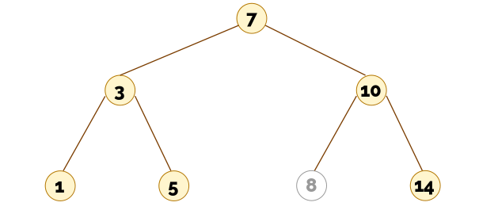
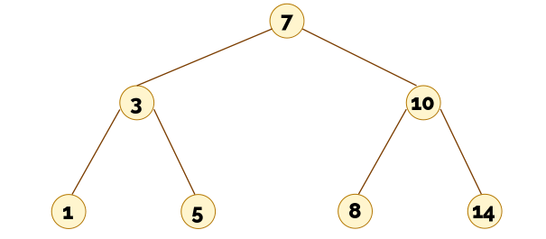
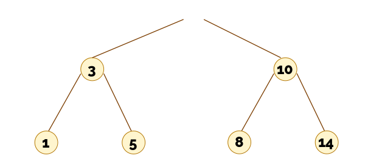

# Ejercicio - Borrado en un árbol binario de búsqueda

## Primer caso: el nodo a borrar no tiene hijos

Supongamos que tenemos el siguiente árbol de búsqueda binario, del cual quiero eliminar el número 8. El árbol tiene un nodo con el valor 8, y ese nodo no tiene hijos.

{{#quiz quiz08_2_1.toml}}

## Segundo caso: el nodo a borrar tiene un hijo

Ahora voy a eliminar el 10 del siguiente árbol de búsqueda binario:

Así me queda el "árbol":

{{#quiz quiz08_2_2.toml}}

## Tercer caso: el nodo a borrar tiene dos hijos

Volvamos al árbol original. Ahora quiero eliminar el 7:

Oops! ¿Cómo arreglo esto para que vuelva a ser un árbol?

Tendremos que colocar otro nodo del árbol en su lugar.

{{#quiz quiz08_2_3.toml}}

