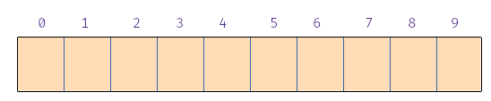

# Ejercicio - Análisis de coste en el caso peor de tablas *hash*


Partimos de una tabla *hash* con *N* = 13. Es decir, con 13 cajones. La tabla *hash* es **abierta**. Es decir, cada cajón puede tener cero, una o más entradas.


Supongamos que queremos insertar claves de tipo Punto, donde Punto es un tipo de datos definido del siguiente modo:

```
struct Punto {
  int x;
  int y;
};
```

Supongamos la siguiente función hash que transforma objetos *p* de tipo `Punto` a números enteros:

<math display="block" class="tml-display" style="display:block math;"><mrow><mi>h</mi><mo form="prefix" stretchy="false">(</mo><mi>p</mi><mo form="postfix" stretchy="false">)</mo><mo>=</mo><mi>p</mi><mi>.</mi><mi>x</mi><mo>+</mo><mi>p</mi><mi>.</mi><mi>y</mi></mrow></math>

{{#quiz quiz10_1_1.toml}}

De nuevo, comenzamos con una tabla hash abierta con 13 cajones, todos vacíos:


Ahora supongamos la siguiente función hash:

<math display="block" class="tml-display" style="display:block math;"><mrow><mi>h</mi><mo form="prefix" stretchy="false">(</mo><mi>p</mi><mo form="postfix" stretchy="false">)</mo><mo>=</mo><mrow><mo fence="true" form="prefix">{</mo><mtable><mtr><mtd class="tml-left" style="padding:0.5ex 0em 0.5ex 0em;"><mn>0</mn></mtd><mtd class="tml-left" style="padding:0.5ex 0em 0.5ex 1em;"><mrow><mtext>si </mtext><mi>p</mi><mi>.</mi><mi>x</mi><mo>≤</mo><mi>p</mi><mi>.</mi><mi>y</mi></mrow></mtd></mtr><mtr><mtd class="tml-left" style="padding:0.5ex 0em 0.5ex 0em;"><mn>1</mn></mtd><mtd class="tml-left" style="padding:0.5ex 0em 0.5ex 1em;"><mrow><mtext>si </mtext><mi>p</mi><mi>.</mi><mi>x</mi><mo>&gt;</mo><mi>p</mi><mi>.</mi><mi>y</mi></mrow></mtd></mtr></mtable><mo fence="true" form="postfix"></mo></mrow></mrow></math>

{{#quiz quiz10_1_2.toml}}

Una pregunta sobre el coste en tiempo, suponiendo que utilizamos esta última función hash:


{{#quiz quiz10_1_3.toml}}


La función *hash* anterior es nefasta. Junta todas las claves en los cajones 0 y 1, quedando el resto de cajones vacíos. Vamos a probar con otra función distinta. Suponemos, en este caso, que *N = 10*:



De nuevo, consideramos la clase `Punto`, pero con la siguiente función *hash*:

<math display="block" class="tml-display" style="display:block math;"><mrow><mi>h</mi><mo form="prefix" stretchy="false">(</mo><mi>p</mi><mo form="postfix" stretchy="false">)</mo><mo>=</mo><mn>2</mn><mo>\*</mo><mo form="prefix" stretchy="false">(</mo><mi>p</mi><mi>.</mi><mi>x</mi><mo>+</mo><mi>p</mi><mi>.</mi><mi>y</mi><mo form="postfix" stretchy="false">)</mo></mrow></math>

{{#quiz quiz10_1_4.toml}}


Vemos que la función *hash* *h* definida mediante <math><mrow><mi>h</mi><mo form="prefix" stretchy="false">(</mo><mi>p</mi><mo form="postfix" stretchy="false">)</mo><mo>=</mo></mrow><mrow><mn>2</mn><mo>\*</mo></mrow><mrow><mo form="prefix" stretchy="false">(</mo><mi>p</mi><mi>.</mi><mi>x</mi><mo>+</mo><mi>p</mi><mi>.</mi><mi>y</mi><mo form="postfix" stretchy="false">)</mo></mrow></math> es mejor que la anterior, pero aún deja la mitad de los cajones vacíos.

{{#quiz quiz10_1_5.toml}}

Una función *hash* es mejor cuanto más uniformemente reparta las claves entre los distintos cajones. Normalmente no conocemos de antemano las claves que insertamos en la tabla, pero si consideramos que la clave a insertar *k* es una variable aleatoria, una función hash es "buena" si todos los cajones de la tabla tienen la misma probabilidad de acoger esa clave. Es decir, si *h(k)* tiene una distribución de probabilidad uniforme.

A esta propiedad se le conoce como **dispersión uniforme**.

A partir de ahora vamos a suponer que nuestra función hash es "buena", en el sentido en el que cumple esta propiedad de dispersión uniforme. Ahora vamos a ver cómo influye el tamaño de la tabla en la eficiencia:


Supongamos que tenemos dos tablas T1 y T2. La primera de ellas tiene 50 cajones. La segunda de ellas tiene 100 cajones. Ahora insertamos 70 claves en cada una de ellas y, tras esto, queremos acceder al valor asociado a una de ellas ¿Cuál de las dos tablas tiene más probabilidad de proporcionar un acceso más eficiente?

{{#quiz quiz10_1_6.toml}}

Concluyendo, hemos visto que hay varios factores que influyen en la rapidez de las operaciones en una tabla *hash*.

* La función *hash* que se utilice. Cuanto más uniformemente distribuya las claves en los distintos cajones, mejor.

* El número de cajones en relación al número de entradas en la tabla. Esto tiene relación con el concepto de **factor de carga**, que se introducirá en el siguiente vídeo.
